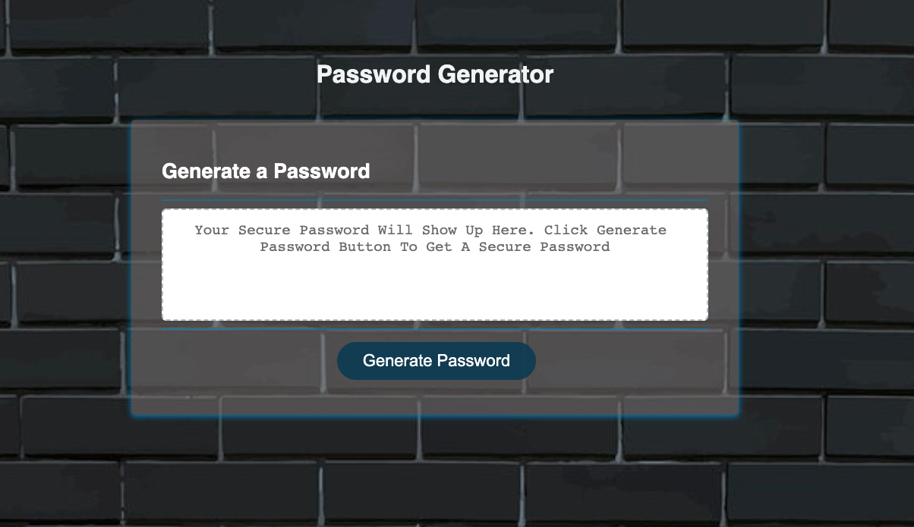
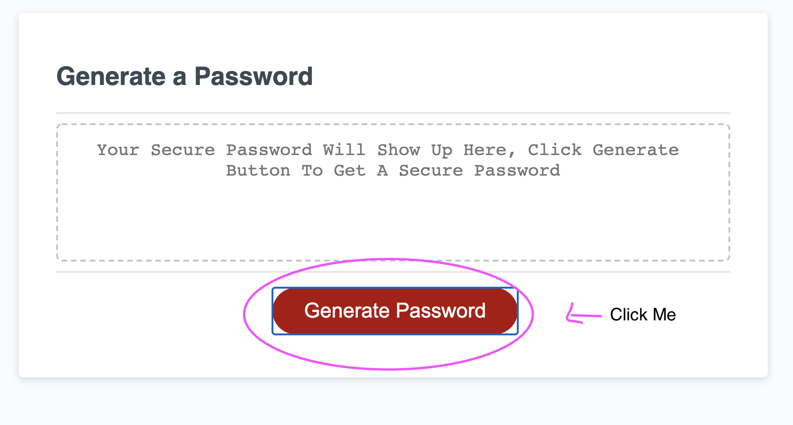
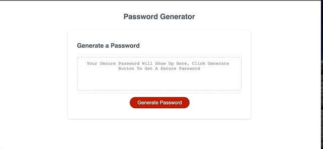
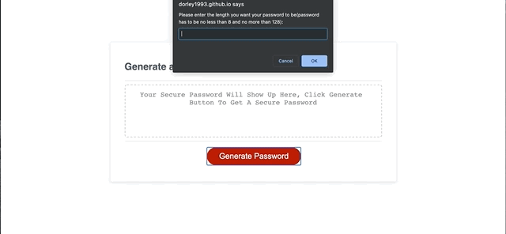
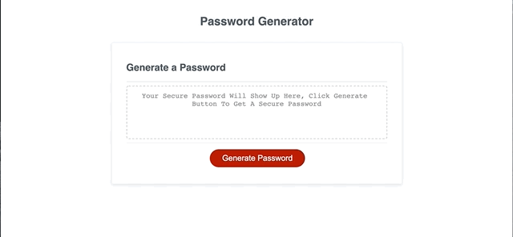

# Password Generator

## Description
---
This is a password generator. In today's tech world, many of us have accounts online or different devices, that request a password. In order to keep our sensitive data safe from hackers, we need strong passwords. If like me, you struggle with coming up with a unique password, then this generator will help you. I wanted to be able to create many different unique strong passwords for my account, that way they will be harder to breach. It is safe and easy to use. 

I wanted to create an easy to use web application, which is responsive and clean. When the user clicks the generate button, I wanted it to respond and the prompts to be easy to follow. This is why I focused on Javascript. I definitely learned new skills and further understood some of the JavaScript concepts. 

    Some of the concepts I learned:
    * the documument method quearySelector, which returns the element selected
    * for loops
    * math random, understanding how to get it to work on an array
    * parseInt
    * Number isNaN
    * event listener's 
    
    I further understood:
    * while loops
    * if, else, else if
    * concat
    * how if else if comes in handy to check users imput

URL: 

## Table of Contents
---
* [Languages](#Languages)
* [Usage](#Usage)
* [License](#License)

## Languages
---
    JavaScript
    HTML
    CSS

## Usage
---
Opening the website you will be faced with the password generator box. 

Click the Generate Password button.

When you click it you will be prompted with a series of questions:
* Please enter the length you want your password to be(password has to be no less than 8 and no more than 128):, Enter the number you choose, if you enter incorrectly it will ask again. 
* Would you like lowercase letters in your new password(enter y for yes or n for no)?, answer y or n. 
* Would you like uppercase letters in your new password(enter y for yes or n for no)?, anwer y or n.
* Would you like numbers in your new password(enter y for yes or n for no)?, answer y or n.
* Would you like a symbol/special character in your new password(enter y for yes or n for no)?
* If you don't pick a number it will promt you again, if you don't select a number between 8 and 128 it will prompt you again.
* If you don't select any of the lowercase, uppercase, numbers, and symbols, it will alert you no selction was made. 

Below is a gif showing how the prompts work. 

 
 

Not selecting a number properly: 

Not selecting a choice:

## License
---
Copyright © Danielle Orley 

Permission is hereby granted, free of charge, to any person obtaining a copy of this software and associated documentation files (the "Software"), to deal in the Software without restriction, including without limitation the rights to use, copy, modify, merge, publish, distribute, sublicense, and/or sell copies of the Software, and to permit persons to whom the Software is furnished to do so, subject to the following conditions:

The above copyright notice and this permission notice shall be included in all copies or substantial portions of the Software.

THE SOFTWARE IS PROVIDED "AS IS", WITHOUT WARRANTY OF ANY KIND, EXPRESS OR IMPLIED, INCLUDING BUT NOT LIMITED TO THE WARRANTIES OF MERCHANTABILITY, FITNESS FOR A PARTICULAR PURPOSE AND NONINFRINGEMENT. IN NO EVENT SHALL THE AUTHORS OR COPYRIGHT HOLDERS BE LIABLE FOR ANY CLAIM, DAMAGES OR OTHER LIABILITY, WHETHER IN AN ACTION OF CONTRACT, TORT OR OTHERWISE, ARISING FROM, OUT OF OR IN CONNECTION WITH THE SOFTWARE OR THE USE OR OTHER DEALINGS IN THE SOFTWARE.

